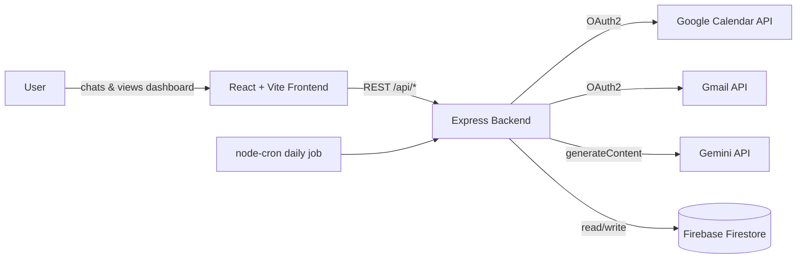

# 🌱 Carbon Coach — AI-Powered Personal Carbon Footprint Coach

> A conversational AI assistant that scans your day, estimates your carbon footprint, and coaches you toward lower-carbon choices — in real time, every morning.

[](https://nodejs.org/)
[](https://react.dev/)
[](https://vitejs.dev/)
[](https://expressjs.com/)
[](https://ai.google.dev/)
[](https://firebase.google.com/)
[](#license)

**Carbon Coach** is a full-stack web app that combines your Google Calendar, your Gmail receipts, an emissions model, and Google's Gemini AI into a daily sustainability coach. Each morning it scans your scheduled travel *and* your inbox — ride receipts, flight confirmations, food delivery orders, and retail purchases — to estimate the day's CO₂e impact, then opens a chat where the AI coach nudges you toward lower-carbon alternatives — walking instead of driving, transit instead of rideshare, a plant-based meal instead of beef — and automatically updates your footprint when you commit to a change. Everything is persisted to **Firebase Firestore**, with a local-JSON fallback for development.

🔗 **Live demo:** [https://carbon-coach-1-3hu1.onrender.com/]

---

## Table of Contents

- [Features](#-features)
- [Screenshot](#-screenshot)
- [Tech Stack](#-tech-stack)
- [Architecture](#-architecture)
- [Getting Started](#-getting-started)
  - [Prerequisites](#prerequisites)
  - [Installation](#installation)
  - [Configuration](#configuration)
  - [Running Locally](#running-locally)
  - [Building for Production](#building-for-production)
- [Project Structure](#-project-structure)
- [API Reference](#-api-reference)
- [Deployment](#-deployment)
- [Security Notes](#-security-notes)
- [Roadmap](#-roadmap)
- [Contributing](#-contributing)
- [License](#license)

---

## ✨ Features

- **🌅 Daily Morning Scan** — A scheduled job (`node-cron`) wakes up at a time you choose and scans both your **Google Calendar** (for travel between events) and your **Gmail inbox** (for receipts) to build the day's activity log.
- **📧 Gmail Receipt Scanning** — Parses recent emails to automatically detect and estimate emissions for:
  - Rideshare receipts (Uber, Lyft) — distance and cost extracted from the email body
  - Flight confirmations — origin/destination airport codes parsed to estimate flight distance and short- vs. long-haul emissions
  - Food delivery orders (DoorDash, Uber Eats, Grubhub, Instacart, Starbucks) — logged under Diet
  - Retail/shopping orders (Amazon, order confirmations, shipping notices) — logged under Shopping, with cost extracted where available
- **💬 Conversational AI Coach** — Powered by Google's Gemini API (`gemini-2.5-flash`), the coach greets you with a personalized summary and asks one targeted question to help you cut emissions for the day.
- **🔄 Dynamic Footprint Adjustment** — Tell the coach "I'll bike instead of drive" or "I had the plant-based burger," and it automatically updates the relevant activity and recalculates your total footprint — no manual form-filling required.
- **➕ Natural-Language Activity Logging** — Mention an unplanned trip, workout, or purchase in chat and the coach logs it as a new activity with an estimated carbon cost.
- **📊 Live Carbon Gauge & Breakdown** — A dashboard gauge shows your projected daily footprint against a sustainable target, broken down by **Travel**, **Home Energy**, **Diet**, and **Shopping**.
- **🧮 Emissions Model** covering:
  | Category | Modes/Options |
  |---|---|
  | Travel | car, rideshare, transit, short/long flight, walking, biking |
  | Diet | beef, poultry, plant-based, standard meal |
  | Shopping | standard shipping, priority shipping, skipped |
  | Home Energy | grid baseline |
- **📈 Footprint History** — Track your daily totals over time via `/api/footprints`.
- **🔐 Google OAuth Integration** — Securely connects to Google Calendar (read-only) to power the daily scan.
- **🗄️ Flexible Storage** — Uses Firebase Firestore in production, with an automatic local-JSON fallback for development (no cloud setup required to get started).
- **🛡️ Hardened API** — Rate limiting, Helmet security headers, HPP protection, and gzip compression built in.

## 📸 Screenshot

> _Add a screenshot of the dashboard here, e.g._
> ``

## 🧱 Tech Stack

| Layer | Technology |
|---|---|
| Frontend | React 19, Vite, Vitest |
| Backend | Node.js, Express 4 |
| AI | Google Gemini API (`@google/genai`) |
| Calendar & Gmail Integration | Google Calendar API + Gmail API (`googleapis`, OAuth2) |
| Database | Firebase Firestore (primary), local JSON fallback for development |
| Scheduling | `node-cron` |
| Security | Helmet, HPP, `express-rate-limit`, CORS |
| Testing | Jest (backend), Vitest (frontend) |
| Hosting | Render (full-stack), Vercel (frontend) |

## 🏗️ Architecture



The backend pulls calendar events and recent Gmail receipts (rides, flights, food delivery, retail orders) into structured activities, runs them through a static emissions model (`scanner.js`), asks Gemini to generate a coaching message (`coach.js`), and persists everything per day to Firestore so the dashboard and chat stay in sync.

## 🚀 Getting Started

### Prerequisites

- [Node.js](https://nodejs.org/) 18 or later
- A [Google AI Studio](https://aistudio.google.com/apikey) account for a Gemini API key
- A [Google Cloud](https://console.cloud.google.com/) project with the **Calendar API** and **Gmail API** enabled and OAuth 2.0 credentials (for the calendar + receipt scanning features)
- A [Firebase](https://console.firebase.google.com/) project with Firestore enabled for storing footprints and chat history

### Installation

```bash
git clone https://github.com/Elle31416/carbon-coach.git
cd carbon-coach
npm run install:all
```

### Configuration

Carbon Coach is configured **at runtime through the in-app Settings panel** (the ⚙️ icon), which writes to `backend/config.json`. On first run, start the app and open Settings to enter:

| Setting | Required for |
|---|---|
| Gemini API Key | AI coaching chat |
| Google Client ID / Secret / Redirect URI | Calendar + Gmail OAuth scan (read-only scopes) |
| Firebase project ID, client email, private key | Firestore persistence (footprints, chat history, settings) |
| Home location & wake-up time | Daily scan scheduling |

> ⚠️ **Never commit `backend/config.json`.** It stores live secrets. Make sure it's listed in `.gitignore` before pushing (see [Security Notes](#-security-notes)). If Firebase isn't configured, the app automatically falls back to a local JSON file for development.

### Running Locally

```bash
npm run dev
```

This runs the backend (`http://localhost:3001`) and the Vite frontend (`http://localhost:5173`) concurrently, with API requests proxied from the frontend to the backend.

### Building for Production

```bash
npm run build
npm start
```

The build compiles the React app into `frontend/dist`, which the Express server serves directly alongside the API.

## 📁 Project Structure

```
carbon-coach/
├── backend/
│   ├── server.js        # Express app, routes, cron scheduler
│   ├── coach.js          # Gemini prompt construction & chat handling
│   ├── scanner.js        # Calendar scan + emissions model (CARBON_FACTORS)
│   ├── db.js              # Config & data persistence (Firestore / local JSON)
│   └── __tests__/         # Jest test suite
├── frontend/
│   └── src/
│       ├── components/    # CarbonGauge, ChatPanel, EmissionBreakdown, Sidebar, ...
│       ├── hooks/          # useChat, useFootprint
│       ├── context/        # CarbonContext
│       └── utils/           # api.js, parseCarbon.js
└── package.json           # Root scripts (install:all, dev, build, start)
```

## 🔌 API Reference

| Method | Endpoint | Description |
|---|---|---|
| `GET` | `/api/config` | Get current settings (secrets masked) |
| `POST` | `/api/config` | Update settings |
| `GET` | `/api/auth-url` | Get Google OAuth consent URL |
| `GET` | `/oauth2callback` | OAuth redirect handler |
| `POST` | `/api/disconnect-google` | Revoke calendar connection |
| `POST` | `/api/scan` | Scan a date's activities & generate the morning coaching message |
| `GET` | `/api/footprints` | Get footprint history |
| `GET` | `/api/chat/:date` | Get chat history for a date |
| `POST` | `/api/chat/:date` | Send a message to the coach |
| `POST` | `/api/adjust-activity` | Manually change an activity's mode |

## ☁️ Deployment

This project is set up to deploy as:
- **Render** — single service serving both the Express API and the built React frontend ([live instance](https://carbon-coach-1-3hu1.onrender.com))
- **Vercel** — frontend-only deployment ([live instance](https://carbon-coach-mocha.vercel.app))

Update the `cors` origin allowlist in `backend/server.js` and the `googleRedirectUri` in your config if you deploy to a different domain.

## 🔒 Security Notes

- `backend/config.json` holds live API keys, OAuth client secrets, and Firebase credentials — **add it to `.gitignore`** and never commit it.
- Prefer environment variables or a secrets manager for production deployments where possible.
- If credentials are ever committed by mistake, rotate them immediately (regenerate the Gemini key, regenerate the OAuth client secret) rather than just deleting the file, since git history retains old commits.

## 🗺️ Roadmap

- [ ] Recurring subscription detection from Gmail (distinct from one-off retail purchases)
- [ ] Environment-variable based configuration as an alternative to `config.json`
- [ ] Support for additional emissions categories (e.g., public transit by mode, EV vs. gas)
- [ ] Weekly/monthly trend charts
- [ ] Multi-user support

## 🤝 Contributing

Issues and pull requests are welcome. For larger changes, please open an issue first to discuss what you'd like to change.

## License

No license has been set for this project yet. Until one is added, all rights are reserved by default. Consider adding an [MIT License](https://choosealicense.com/licenses/mit/) if you'd like others to freely use and contribute to the code.
